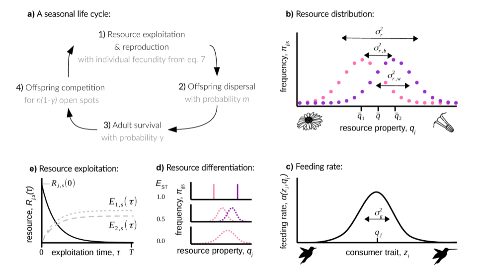

In patch- or habitat-structured populations, different ecological processes lead to polymorphism at different spatial scales. While spatial heterogeneity and divergent selection favors phenotypic variation between patches, local competition and negative frequency-dependent selection promotes variation within patches. These two processes are influenced by gene flow in opposite ways. On one hand, limited dispersal facilitates the emergence of variation between patches but on the other hand hinders variation within patches. 

So far, most of theory has looked at the effects of dispersal on divergent selection and on negative frequency-dependent selection in isolation of one another. In this project, we use a combination of mathematical modelling and computer simulations to investigate how resource variation within and between habitats influences the way natural selection shapes phenotypic variation for a consumer trait.  As an example of a consumer trait, consider the beak length of a hummingbird, as depicted in the thumbnail of this project (credits to *Getty Images*). The figure below provides a summary and exemples of this biological scenario.

  

In this publication below, we show that when resources vary both within and between patches, the co-occurrence of divergent and frequency-dependent selection can lead to phenotypic polymorphism for many levels of gene flow, thus expanding the range of parameters under which polymorphism emerges.

* M. Schmid, C. Rueffler, L. Lehmann, C. Mullon. **Foraging for locally and spatially varying resources: Where exploitation competition, local adaptation and kin selection meet**. *[American Naturalist](https://doi.org/10.1086/727483)*. 2023.

Moreover, because adaptive phenotypic polymorphism is difficult to achieve when quantitative traits are encoded by many loci of small effect, local competition and spatial heterogeneity can impose strong selection on genetic architecture. As a second stage in this research program we are therefore studying how resource distributions favour distinct genetic architectures. In particular, we are focusing on the role of frequency-dependent selection in driving the evolution of "concentrated" architectures, i.e. those composed of few alleles of large effect, or of loci found in weakly recombining regions of the genome.
