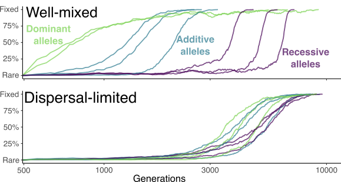

In this project, I use mathematical models and computer simulations to study features in the genome of structured populations. 
I'm currently working on two relevant evolutionary problems: (i) the rate and signature of adaptation in spatially divided populations, and (ii) the distribution of tandem repeat sequences (microsatellites) between and within individuals. I detail these two projects below. 

### Rate and signature of adaptation

In this project, I am especially interested in the time that new advantageous mutations or standing genetic variants take to fix via selective sweeps, and how this fixation shapes the variation of neutral alleles surrounding this sweeping mutation. The figure below illustrates the trajectory of alleles to become widespread in populations that are structured versus those that are well mixed.

  

In contrast to earlier research, I discovered that population structure can actually speed up the rate of genetic fixation when selection pressure is moderate. 
This happens because mildly limited dispersal only slightly inflates effective population size (which could slow down fixation). It is, however, enough to increase homozygosity due to inbreeding, making rare recessive alleles more exposed to selection, ultimately speeding up the fixation process. More details can be found in our preprint.

* V. Sudbrack and C. Mullon. **Fixation times of <i>de novo</i> and standing beneficial variants in subdivided populations**. (Preprint) *[BioRxiv](https://www.biorxiv.org/content/10.1101/2023.07.07.548167)*. 2024.

Overall, our goal in this ongoing project is to better understand how dispersal, life cycle, genetic dominance, and population structure interact and influence the pace of adaptation and the molecular signature of such adaptation.

### Distribution of Tandem Repeat sequences (microsatellites)

Tandem Repeat sequences (TRs) are repeated patterns of DNA that significantly contribute to genetic diversity as they exhibit variation both within and between populations. This variability makes them useful as genetic markers in biological and forensic analyses. For an example, see a picture of DNA profiling in the thumbnail image of this project (credits to *gopixa/Shutterstock.com*).

Not only TR variation is shaped by usual evolutionary processes, as selection and genetic drift, but also by processes that take place during DNA duplication: saltatory amplification, due to replication slippage, and unequal recombination between homologous TR sequences. Previous research focused on the outcome of these processes in large haploid populations that mate randomly, but many species can self-fertilize, leading to inbreeding and more similarity between individuals. I thus use mathematical analyses and individual-based simulations to study how inbreeding (due to partial selfing) shapes the polymorphism of TR sequences in diploid organisms. 

We are preparing a manuscript where I show that inbreeding plays a big role in shaping the genetic diversity of TRs in populations: selfing leads to shorter and less diverse TR sequences. Stay tuned!

